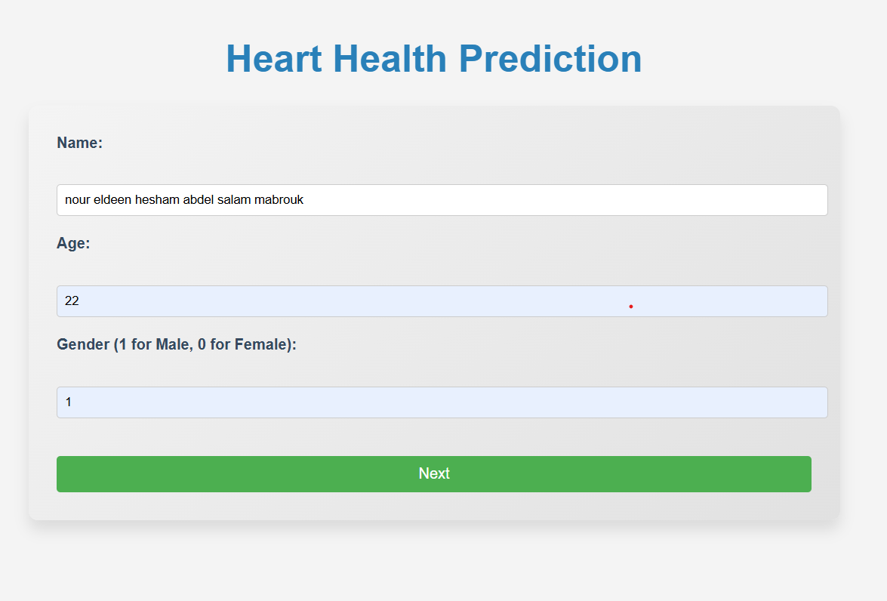
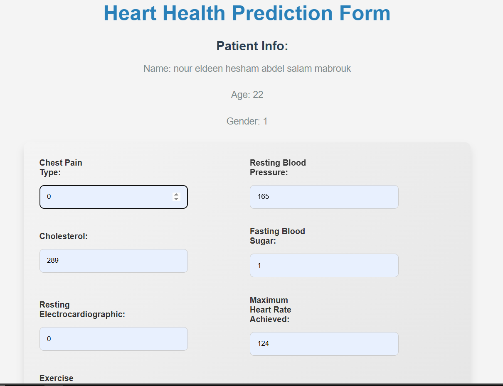
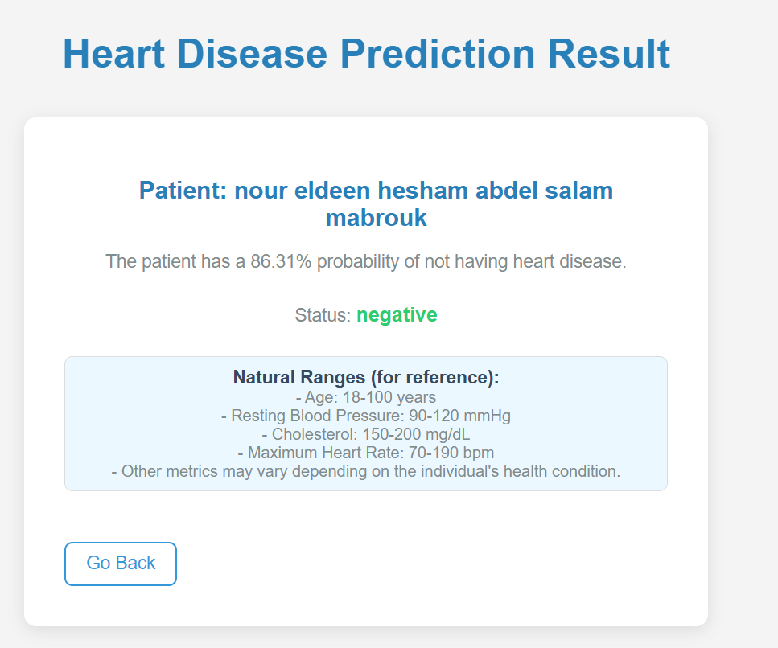

# Heart Disease Prediction Web Application

## Overview
A web application that predicts the likelihood of a person having heart disease based on input features such as age, blood pressure, cholesterol levels, and other health metrics. The application is built using Flask and uses a combination of three models: Logistic Regression, Random Forest, and XGBoost. The application achieves an accuracy of 87% using an ensemble approach that leverages the strengths of each model.
## Features
- Input health metrics through a user-friendly web interface.
- Predicts heart disease risk (Positive or Negative) using multiple machine learning models.
- Displays results instantly on a results page
- The combination of Logistic Regression, Random Forest, and XGBoost ensures more reliable and accurate predictions.

## Installation

### Clone the repository:

git clone https://github.com/NOUR12321/HeartHealthDiseases.git
cd heart-disease-prediction
Install dependencies:

pip install -r requirements.txt
Train the Logistic Regression model (optional, if model.pkl is not included):

python train_model.py
Run the application:

python app.py
Open your browser and go to:

http://127.0.0.1:5000/

## Input Fields
The following health metrics are required:

- **Age**: Patient's age.  
- **Sex**: Gender (1 = Male, 0 = Female).  
- **Chest Pain Type (cp)**: Types of chest pain (0 to 3).  
- **Resting Blood Pressure (trestbps)**: Measured in mmHg.  
- **Cholesterol (chol)**: Cholesterol level in mg/dl.  
- **Fasting Blood Sugar (fbs)**: 1 if >120 mg/dl, otherwise 0.  
- **Resting ECG (restecg)**: ECG results (0 to 2).  
- **Max Heart Rate Achieved (thalach)**: Maximum heart rate achieved.  
- **Exercise-Induced Angina (exang)**: 1 = Yes, 0 = No.  
- **ST Depression (oldpeak)**: ST depression induced by exercise.  
- **Slope of Peak ST Segment (slope)**: Values range from 0 to 2.  
- **Number of Major Vessels (ca)**: Values range from 0 to 3.  
- **Thalassemia (thal)**:  
  - 3 = Normal  
  - 6 = Fixed Defect  
  - 7 = Reversible Defect  

---

## Example Use Case
1. Enter health metrics such as age, cholesterol, and others in the input form.  
2. Submit the form to get a prediction.  
3. View the result, which will indicate:  
   - **Positive (At Risk)**: Indicates a likelihood of heart disease.  
   - **Negative (Not at Risk)**: Indicates no significant risk.  

---

## Model Details
- **Algorithm**: Logistic Regression, Random Forest, XGBoost.

- **Accuracy**: 87% (ensemble of models)  
- **Dataset**: Heart disease dataset sourced from Kaggle/UCI repository  

---

## Screenshots
### Input Form: 
** 
**  

### Prediction Result:  
*()*  

---

## Future Improvements
- Support for additional machine learning models.  
- Improved UI/UX for a more engaging user experience.  
- Add functionality to allow users to download their prediction results. 
- Enhance model performance using ensemble methods like Voting Classifier or Stacking. 

---

## License
This project is open-source and available under the MIT License.
